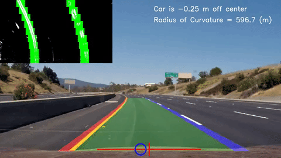

# Advanced Lane Finding
>   
> #### [Full video](https://www.youtube.com/watch?v=37lNFBmEjBU) on YouTube
# Objective
> Process a video input:
> - Lane Curvature
> - Distance from center
> - Lane lines
> 
# What I learned
> * Handle curved lanes
> * Camera calibration
> * Warping, color spaces, gradients
> 
> #### Languages
> *  python
>   * numpy
>   * Open CV
>   * matplotlib
> 
# [Write Up](WriteUp.ipynb)